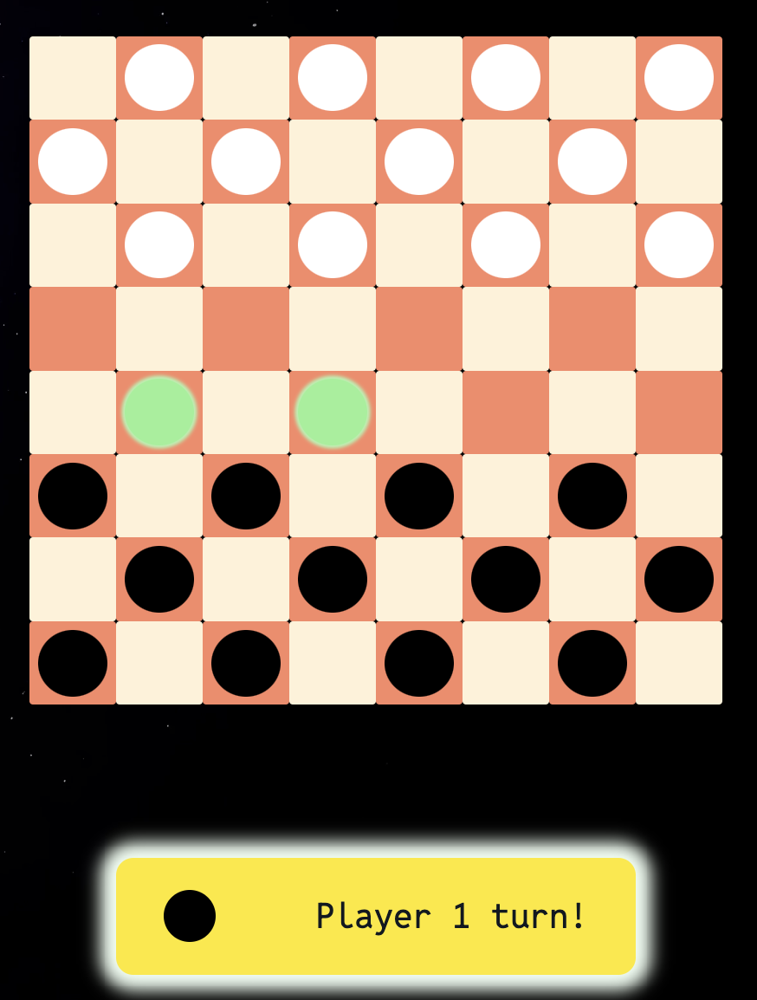
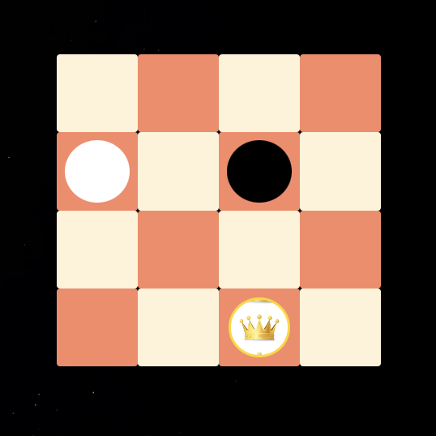
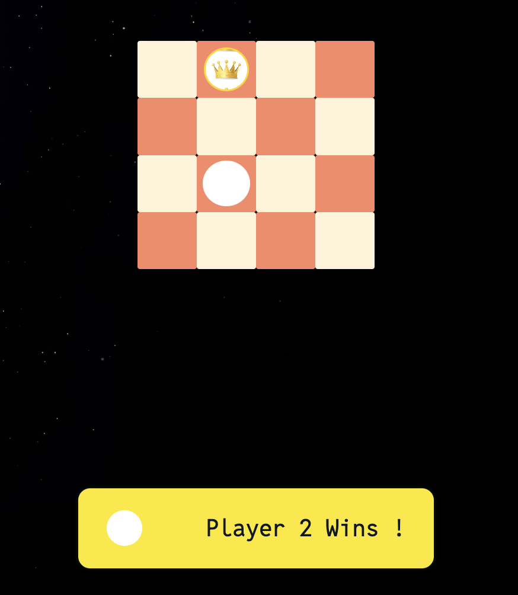

# Expandables Checkers

## Game Description

In a game of Checkers, two players face off on a board consisting of 64 squares, similar to a chessboard. The normal game pieces, there are 24 in total, are circular disks with different colors, adding to the visual appeal of the game.

What's exceptional about this game is its expandability. Whether you prefer to play with more or fewer checkers, you have the flexibility to adjust the game according to your preference.

## Technology Used

- HTML
- CSS
- Javascript
- Github

### Deployment

Here is the link to the game  ➡️  [Expandables Checkers](https://game-checkers.vercel.app/)

## The Game

## Some Game Rules

### Turns

In Checkers, the game starts with the Black player making the first move, followed by alternating turns between players. Each player moves their pieces diagonally forward, restricted to the dark squares on the board. A piece can typically only move one square at a time unless it's executing a jump move.

### Capturing

A player has the opportunity to capture an opponent's piece by executing a jump move, leaping over the opponent's piece and landing on an empty square on the opposite side. Each jump allows the player to capture only one piece, but they have the option to execute multiple jumps in a single turn if the arrangement of the pieces permits.

### Kings

Once a piece reaches the farthest row on the opposite side, it gains the status of a "king" in the game of Checkers. Kings possess the ability to move both forward and backward along the board, adding strategic depth to their movements.

### Eating

A player must eat or capture an opponent's man when the opposing man occupies the next square and there isn't any other man on the next square. If a player does capture an opponent's piece, they are forced to do another capture move if possible.

### Winning

A player who captures all their opponents' checkers wins. Players continue jumping to capture checkers until one color remains on the board. You can also win checkers if you block your opponent's pieces so they can't make any more moves.

## Getting Started

    1. Players have the option to input their names into the designated input boxes for Player 1 and Player 2.
    2. They can also select their preferred game mode, which includes options such as:
        - Standard
        - Fast Game
        - Ultra Fast Game
        - Slow Game
        - Ultra Slow Game
        - Customizable board size.
    3. Once players have made their selections, they can initiate the game by pressing the play button.
    4. The game begins with the black checker moving first, followed by the white one.
    5. The game continues until one player loses all their checkers or runs out of moves, at which point the other player is declared the winner.
    6. To reset current game, players can click the reset button to reset the board and play again.
    7. They can also click the "main page" button to return to the main page and customize their checker board.
    8. Moreover, players have the option to customize the board size by clicking the zoom button. They can also personalize the board color to match their preferences.

### Future Development

- [] add timer as a factor to decide player's win/lose.
- [] computer can be one of the player option.

### Summary

Developing everything from scratch can be challenging, but throughout this project, I've learned the importance of simplicity and building small functions that serve specific purposes. As when developing throught the project, the function can get more and more complex. So keeping things straightforward and focusing on creating small, unique functionalities has been key to the project's success. By breaking down tasks into small components, we can ensure a smoother development process.
